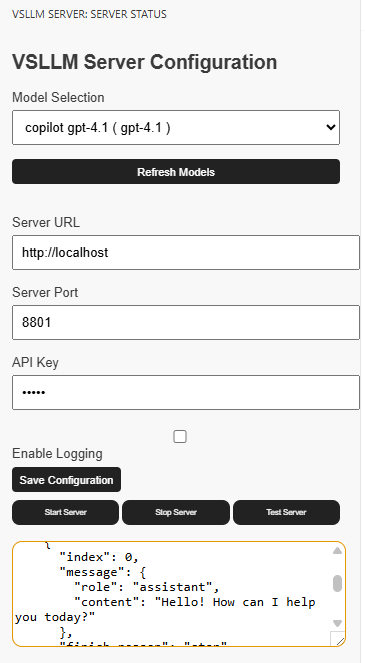

# VSCode LLM Server

Expose VSCode chat models as an OpenAI-compatible API endpoint. This extension provides a local HTTP server with a `/v1/chat/completions` endpoint, powered by VS Code's Language Model API.


## New in 0.0.5
- **Tool / function calling support**: OpenAI `tools` are forwarded to the VS Code Language Model API and `tool_calls` are returned to the client (both streaming and non-streaming), with `finish_reason: "tool_calls"`. This is what agent clients such as **opencode**, Cline, Aider or Continue need in order to actually run tools instead of stopping after the first sentence.
- **Full tool round-trip**: assistant `tool_calls` and `role: "tool"` results sent back by the client are converted into `LanguageModelToolCallPart` / `LanguageModelToolResultPart` instead of being flattened into text.
- **Traffic Monitor GUI**: a new panel (`VSLLM Server: Open Traffic Monitor`) shows every request in and out — payloads, streamed chunks, tool calls, timings, bytes, warnings and errors.
- **Status bar counter** with live request/error counts that opens the monitor.
- **Security hardening**: binds `127.0.0.1` by default, enforces `vsllmServer.apiKey` as a Bearer token, makes CORS opt-in, and caps request bodies. See [Security](#security).
- **More forgiving routing**: `/chat/completions`, trailing slashes and query strings are accepted, `/health` returns a status document, and `/v1/models` now lists the real Copilot models.
- **Correct model selection**: an explicitly requested `model` is honoured, and an unknown one returns 404 instead of silently answering with a different model.
- **Better diagnostics**: port conflicts, invalid JSON, unsupported content parts, empty model responses and unknown routes are surfaced instead of failing silently.
- **Integration tests**: `test_vsllm.py` plus `requirements-dev.txt`.
- **API key kept out of source control**: `vsllmServer.apiKey` is machine-scoped, so it can no longer be written into a committed `.vscode/settings.json`.
- **Packaging fix**: the manifest was missing a `publisher`, so the VSIX installed as `undefined_publisher.vsllm-server` next to any existing install instead of replacing it, leaving two copies racing for the port.

## New in 0.0.3
- **Full OpenAI API compatibility**: Now works with clients like qwen-code, Continue, and other OpenAI-compatible tools
- **Streaming support**: Added Server-Sent Events (SSE) streaming for `stream: true` requests
- **Flexible message content formats**: Supports both string content and array content formats (multimodal-style)
- **New `/v1/models` endpoint**: List available models via GET request
- **CORS support**: Cross-origin requests are now supported
- **Improved error handling**: Better error responses following OpenAI API error format

## New in 0.0.2
- Modern esbuild build pipeline for faster, reliable TypeScript builds
- Extension and server configuration now fully align with VS Code settings (model, URL, port, etc.)
- Enhanced sidebar UI and logging, especially for model selection
- Improved sidebar panel and webview styling
- Initial VS Code settings configuration added
- Dependency and script updates for easier development

## New in 0.0.1
- Commands are no longer available in the Command Palette.
- Access all server controls and configuration via the VSLLM Server sidebar icon.


## Features
- Expose VS Code chat models as an OpenAI-compatible API
- Local HTTP server for chat completions
- Configure model, URL, port, API key, logging, and max tokens via VS Code settings or sidebar
- Start, stop, restart server, and open configuration panel from the VSLLM Server sidebar

### Sidebar Panel 


## Prerequisites
**Important**: This extension requires Node.js to be available in your environment. If you're using conda, make sure to activate your conda environment that contains Node.js before starting VS Code:

```bash
conda activate your_env_name  # where your_env_name contains nodejs
code .  # then start VS Code from the activated environment
```

This ensures the extension can properly compile TypeScript and run without getting stuck in "activating" state.

## Installation
1. Download or build the `.vsix` package.
2. In VS Code, open the command palette (`Ctrl+Shift+P`) and run `Extensions: Install from VSIX...`.
3. Select the `.vsix` file to install.
4. After installation, look for the VSLLM Server icon in the sidebar to access all features.

## Configuration
All options are available in the VSLLM Server sidebar panel or in VS Code settings:

- **Model Selection**: ⚠️ The settings dropdown for model selection is a placeholder and will show "pending...". To select a model, open the VSLLM Server sidebar panel first. The sidebar will show the latest available models and allow you to select one dynamically.
- **Server URL**: Set the base URL (default: `http://localhost`).
- **Bind Address** (`vsllmServer.host`): interface to listen on (default: `127.0.0.1`, this machine only).
- **Server Port**: Set the port number (default: `8801`).
- **API Key**: Optional; when set, clients must authenticate. Stored in your **user** settings, never in `.vscode/settings.json`.
- **Allowed CORS Origins** (`vsllmServer.allowedOrigins`): empty by default, so no CORS headers are sent.
- **Max Request Size** (`vsllmServer.maxRequestBytes`): default 1 MiB.
- **Enable Logging**: Toggle verbose logging (writes to the "VSLLM Server" output channel).
- **Enable Tool Calling** (`vsllmServer.enableToolCalling`, default `true`): forward client tool definitions to the model. Turn this off only to reproduce the "agent stops after one message" behaviour.
- **Monitor History Size / Capture Bodies / Body Capture Limit**: control how much traffic the monitor keeps in memory.

## Security

The server exposes your Copilot session over plain HTTP, so treat it like a credential:

- **It listens on `127.0.0.1` by default**, reachable only from this machine. Setting `vsllmServer.host` to `0.0.0.0` exposes the API to every machine on your network — only do that together with an API key. The extension warns you when it binds a non-loopback address.
- **Set `vsllmServer.apiKey`** to require `Authorization: Bearer <key>` on every request (compared in constant time). With a blank key the server accepts any local request without authentication.
- **The API key lives in your user settings.** It is a machine-scoped setting, so it cannot be set from `.vscode/settings.json` — that file is usually committed, and a key placed there would leak into source control. Saving from the sidebar writes it to user settings and clears any stale workspace copy.
- **CORS is disabled by default.** Until you list origins in `vsllmServer.allowedOrigins`, browsers cannot read responses, which prevents arbitrary web pages you visit from driving your Copilot session. Use `*` only alongside an API key.
- **Request bodies are capped** at `vsllmServer.maxRequestBytes` (1 MiB by default); larger requests get HTTP 413.
- The traffic monitor **redacts the `Authorization` header** in captured requests, so exported logs do not leak your key.

## Traffic Monitor

Open it from the sidebar button **📊 Open Traffic Monitor**, the view title icon, the status bar entry, or the command palette (`VSLLM Server: Open Traffic Monitor`).

The monitor shows, live:

- every HTTP request the extension receives (method, path, client address, user agent, headers)
- the raw request body plus a decoded summary: message count and roles, prompt size, `stream` flag, tools offered by the client, `tool_choice`
- which VS Code model was actually selected for the request
- the streamed model text as it arrives, chunk count, time-to-first-token and total duration
- tool calls returned to the client, with their arguments
- bytes in / bytes out per request and in aggregate
- `finish_reason`, HTTP status, errors, and warnings that explain protocol problems
- a per-request timeline of every step

Controls: pause/resume capture, clear, filter (matches paths, bodies, tool names, errors), "problems only", and **Export JSON** to save the whole capture for sharing or offline analysis.

### Debugging an agent client that stops early

If a client such as opencode prints one sentence ("Let me fetch the repo...") and then stops, open the monitor and look at the last request:

- **tools offered by client** is non-empty but **tool calls returned** is `0` → the model answered with plain text. Check that `vsllmServer.enableToolCalling` is on; the monitor adds an explicit warning when it is off.
- **finish reason** should be `tool_calls` whenever the model wants to run a tool. `stop` means the turn really ended.
- A `404` record means the client's base URL is wrong (it must point at `http://localhost:<port>/v1`).
- An error record shows the exact message from the VS Code Language Model API (consent, quota, context length, ...).

## Usage
- Use the VSLLM Server sidebar icon to start, stop, restart the server, and open the configuration panel.
- Configure all options in the sidebar or in the settings panel under "VSLLM Server Configuration".
- Access the API at `http://localhost:8801/v1/chat/completions` (or your configured URL/port).

## Using with OpenAI-Compatible Clients

This extension exposes VS Code's Copilot models as an OpenAI-compatible API. You can use any OpenAI client library or tool by pointing it to the VSLLM Server URL.

### opencode

Add the server as an OpenAI-compatible provider in `opencode.json` (use the model id shown by `GET /v1/models`, e.g. `gpt-4o`):

```json
{
  "$schema": "https://opencode.ai/config.json",
  "provider": {
    "vsllm": {
      "npm": "@ai-sdk/openai-compatible",
      "options": { "baseURL": "http://localhost:8801/v1" },
      "models": { "gpt-4o": { "name": "Copilot via VSLLM" } }
    }
  }
}
```

Tool calling must stay enabled (`vsllmServer.enableToolCalling`, on by default) — otherwise opencode receives a plain text answer with `finish_reason: "stop"` and ends the turn right after the model announces what it is about to do.

### Python (OpenAI SDK)
```python
from openai import OpenAI

client = OpenAI(
    base_url="http://localhost:8801/v1",
    api_key="not-needed"  # API key is optional
)

response = client.chat.completions.create(
    model="vsllm-copilot",
    messages=[{"role": "user", "content": "Hello!"}],
    stream=True  # Streaming supported
)

for chunk in response:
    if chunk.choices[0].delta.content:
        print(chunk.choices[0].delta.content, end="")
```

### qwen-code / Continue / Other Extensions
Set your OpenAI base URL to point to VSLLM Server:
```
OPENAI_BASE_URL=http://localhost:8801/v1
```

### curl
```bash
# Non-streaming
curl http://localhost:8801/v1/chat/completions \
  -H "Content-Type: application/json" \
  -d '{"messages": [{"role": "user", "content": "Hello!"}]}'

# Streaming
curl http://localhost:8801/v1/chat/completions \
  -H "Content-Type: application/json" \
  -d '{"messages": [{"role": "user", "content": "Hello!"}], "stream": true}'

# List models
curl http://localhost:8801/v1/models
```

## Testing

`test_vsllm.py` exercises a **running** server (start the extension, then start the server
from the sidebar). It skips automatically when nothing is listening.

```bash
pip install -r requirements-dev.txt
pytest test_vsllm.py        # assertions
python test_vsllm.py        # verbose manual smoke run
```

Set `VSLLM_BASE_URL` to target a non-default address, and `VSLLM_API_KEY` when the server
has an API key configured.

## License
MIT

## Issues
Report issues at [GitHub Issues](https://github.com/jianlins/vsllm_server/issues).
